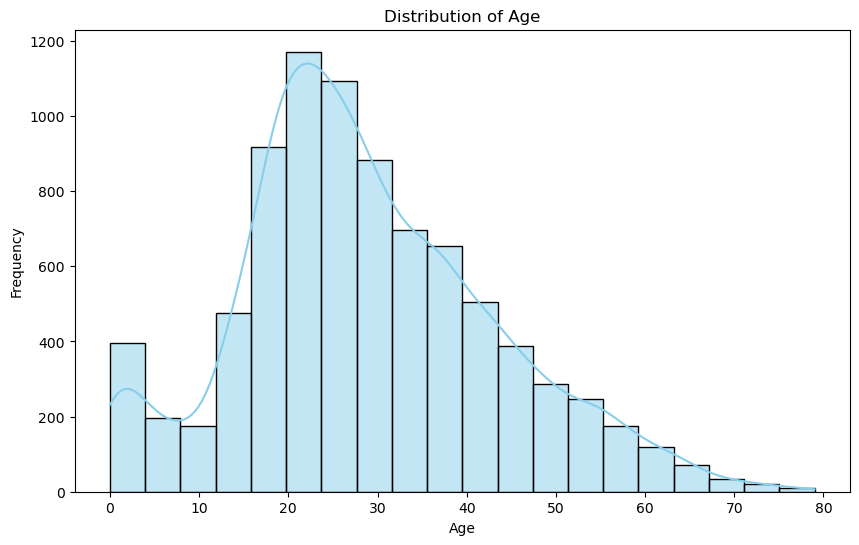
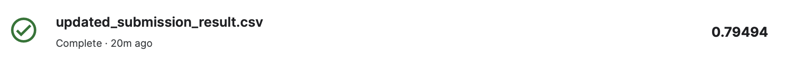

# Kaggle Spaceship Titanic 데이터 분석, 머신러닝/딥러닝 모델 구축하기
<hr/>

### 1. 프로젝트 설명
- 한 달 전 발사된 여객선 'Spaceship Titanic' 에는 13000명의 승객이 탑승해 있다.
- 항해 중 시공간 이상 현상으로 인해 승객의 절반 가량이 다른 차원으로 이동하게되었다.
- 실종된 승객을 찾기 위해 어떤 승객이 이상 현상에 의해 이동되었는지 예측해보자.
* Kaggle Link: <https://www.kaggle.com/competitions/spaceship-titanic/overview>

### 2. 데이터셋
- 데이터 설명:
* Data Download Link: <https://www.kaggle.com/competitions/spaceship-titanic/data>

### 3. 데이터 대략적으로 확인하기
- 데이터의 대략적인 모습:
```python
df.head(3).T
```


- 데이터 타입 확인:
```python
df=pd.read_csv('train.csv')
df.dtypes
```


- 결측치 확인:
```python
missing_values = df.isnull().sum()
missing_percentage = (df.isnull().sum() / len(df)) * 100
missing_info = pd.DataFrame({
    'Missing Values': missing_values,
    'Missing Percentage': missing_percentage
})
print(missing_info)
```

데이터의 결측치가 작은 것을 알 수 있다

### 4. 데이터 세부적 분석하기

#### 4.1 훈련 데이터의 피쳐 정하기
- 14개의 속성중, 훈련데이터의 속성으로 사용 불가능한 것은 종속변수인 Transported 와, Unique Id인 PassengerId, 승객의 이름인 Name 으로 예상된다.
- 다만, PassengerId는 앞에 서술 한 것 처럼 gggg_pp 형식이며, gggg는 그룹번호, pp는 그룹내 번호 이기때문에 그룹의 개수를 확인해보았다
```python
df['Group']=df['PassengerId'].str.split('_').str[0]
len(df['Group'].unique())
```
```
6217
```
- 그룹의 개수가 너무 많기 때문에 PassengerId는 훈련데이터의 피쳐로 사용하지 않기로 한다
- 필요하지 않은 열 제외한 훈련 데이터셋 X
```python
X=df.drop(['PassengerId','Name','Transported'],axis=1)
```

#### 4.2 결측치 대치
1. object 타입의 데이터 결측값 대치

- 고유값 확인
```python
object_columns = X.select_dtypes(include=['object'])

for column in object_columns.columns:
    unique_values = X[column].unique()
    print(f"Unique values in {column}: {unique_values}")
```
```
Unique values in HomePlanet: ['Europa' 'Earth' 'Mars' nan]
Unique values in CryoSleep: [False True nan]
Unique values in Cabin: ['B/0/P' 'F/0/S' 'A/0/S' ... 'G/1499/S' 'G/1500/S' 'E/608/S']
Unique values in Destination: ['TRAPPIST-1e' 'PSO J318.5-22' '55 Cancri e' nan]
Unique values in VIP: [False True nan]
```
- Cabin열의 고유값 개수 확인
```python
print( X['Cabin'].nunique())
```
```
6560
```
- 고유값의 개수가 너무 많아 제거
```python
X=X.drop('Cabin',axis=1)
```
- HomePlanet 피쳐의 고유값 개수 확인 및 대치(최빈값)
```python
X['HomePlanet'].value_counts()
```
```
HomePlanet
Earth     4602
Europa    2131
Mars      1759
Name: count, dtype: int64
```
```python
X['HomePlanet'].fillna('Earth', inplace=True)
```
- CryoSleep 피쳐의 고유값 개수 확인 및 대치(최빈값)
```python
X['CryoSleep'].value_counts()
```
```
CryoSleep
False    5439
True     3037
Name: count, dtype: int64
```
```python
X['CryoSleep'].fillna(False, inplace=True)
```
- Destination 피쳐의 고유값 개수 확인 및 대치(최빈값)
```python
X['Destination'].value_counts()
```
```
Destination
TRAPPIST-1e      5915
55 Cancri e      1800
PSO J318.5-22     796
Name: count, dtype: int64
```
```python
X['Destination'].fillna('TRAPPIST-1e', inplace=True)

```
- VIP 피쳐 고유값 개수 확인 및 대치(최빈값)
```python
X['VIP'].value_counts()
```
```
VIP
False    8291
True      199
Name: count, dtype: int64
```
```python
X['VIP'].fillna(False,inplace=True)
```

2. 실수 타입의 데이터 결측값 대치
- Age열 그래프로 그려 확인해보기
```python
plt.figure(figsize=(10, 6))
sns.histplot(X['Age'], bins=20, kde=True, color='skyblue')
plt.title('Distribution of Age')
plt.xlabel('Age')
plt.ylabel('Frequency')
plt.show()
```


- 15~35 사이에 데이터들이 분포, 평균값(28.82)로 대치
```python
X['Age'].fillna(X['Age'].mean(), inplace=True)
```
- RoomService, FoodCourt, ShoppingMall, Spa, VRDeck 은 탑승객이 지불한 내역임
- 그래프로 분포 확인해보기
- RoomService의 분포 그래프
```python
X['RoomService'].max()
```
```
14327.0
```
```python
plt.figure(figsize=(10, 6))
sns.countplot(x=pd.cut(X['RoomService'], bins=range(0, 15000, 1000), right=False), palette='viridis')
plt.title('Distribution of RoomService (Binned)')
plt.xlabel('RoomService')
plt.ylabel('Count')
plt.show()
```


- FoodCourt, ShoppingMall, Spa, VRDeck 의 그래프 (코드 생략)


- 데이터의 분포가 0~500 사이에 대부분 분포해 있는것을 확인 가능하다


- csv파일로 확인했을때, 아무것도 소비하지 않은 0이 굉장히 많은것에 착안해, 소비가 0인 개수를 확인 후 결측치를 0으로 대치해줌
```python
print((X['RoomService'] == 0).sum())
print((X['Spa'] == 0).sum())
print((X['ShoppingMall'] == 0).sum())
print((X['FoodCourt'] == 0).sum())
print((X['VRDeck'] == 0).sum())
X.shape
```
```
5577
5324
5587
5456
5495
(8693, 10)
```
```python
columns_to_fill_zero = ['RoomService', 'FoodCourt', 'ShoppingMall', 'Spa', 'VRDeck']
X[columns_to_fill_zero] = X[columns_to_fill_zero].fillna(0)
```
- 결측치가 전부 제거 되었는지 확인
```python
print(X.isnull().sum())
```
```
HomePlanet      0
CryoSleep       0
Destination     0
Age             0
VIP             0
RoomService     0
FoodCourt       0
ShoppingMall    0
Spa             0
VRDeck          0
```

#### 4.3 one-hot encoding
- HomePlanet와 Destination 열을 범주형으로 변환 후 one-hot encoding
```python
X['HomePlanet'] = X['HomePlanet'].astype('category')
X['Destination'] = X['Destination'].astype('category')

X_encoded = pd.get_dummies(X, columns=['HomePlanet', 'Destination'], drop_first=True)
```
- bool 자료형에 대해 True는 1, False는 0으로 변환
```python
bool_columns = ['CryoSleep', 'VIP', 'HomePlanet_Europa', 'HomePlanet_Mars', 'Destination_PSO J318.5-22', 'Destination_TRAPPIST-1e']
X_encoded[bool_columns] = X_encoded[bool_columns].astype(int)
```
- 데이터 결측치 및 타입 확인
```python
print(X_encoded.isnull().sum())
print(X_encoded.dtypes)
```
```
CryoSleep                    0
Age                          0
VIP                          0
RoomService                  0
FoodCourt                    0
ShoppingMall                 0
Spa                          0
VRDeck                       0
HomePlanet_Europa            0
HomePlanet_Mars              0
Destination_PSO J318.5-22    0
Destination_TRAPPIST-1e      0
dtype: int64
CryoSleep                      int64
Age                          float64
VIP                            int64
RoomService                  float64
FoodCourt                    float64
ShoppingMall                 float64
Spa                          float64
VRDeck                       float64
HomePlanet_Europa              int64
HomePlanet_Mars                int64
Destination_PSO J318.5-22      int64
Destination_TRAPPIST-1e        int64
dtype: object
```

### 5. 상관계수 확인
```python
data_with_target = pd.concat([y, X_encoded], axis=1)

correlation_with_target = data_with_target.corr()['Transported'].sort_values(ascending=False)


print(correlation_with_target)
```
```
Transported                  1.000000
CryoSleep                    0.460132
HomePlanet_Europa            0.176916
FoodCourt                    0.045583
HomePlanet_Mars              0.019544
ShoppingMall                 0.009391
Destination_PSO J318.5-22    0.000092
VIP                         -0.037261
Age                         -0.074249
Destination_TRAPPIST-1e     -0.096319
VRDeck                      -0.204874
Spa                         -0.218545
RoomService                 -0.241124
Name: Transported, dtype: float64
```
- 소비 내역이 대체로 큰 상관관계가 있는것을 확인, 총 지출 피쳐를 추가
```python
X_encoded['total'] = X_encoded[['RoomService', 'Spa', 'VRDeck', 'FoodCourt', 'ShoppingMall']].sum(axis=1)
```
### 6. 모델 테스트

1. 로지스틱 회귀 (정규화x)
```python
X_train, X_test, y_train, y_test = train_test_split(X_encoded, y, test_size=0.2, random_state=42)

from sklearn.linear_model import LogisticRegression

model = LogisticRegression()

model.fit(X_train, y_train)

y_pred = model.predict(X_test)

accuracy = accuracy_score(y_test, y_pred)
print(f'Accuracy: {accuracy}')

report = classification_report(y_test, y_pred)
print('Classification Report:')
print(report)
```
```
Accuracy: 0.777458309373203
Classification Report:
              precision    recall  f1-score   support

       False       0.79      0.75      0.77       861
        True       0.77      0.80      0.78       878

    accuracy                           0.78      1739
   macro avg       0.78      0.78      0.78      1739
weighted avg       0.78      0.78      0.78      1739
```
2. 상관계수 높은 행만 선택 (로지스틱 회귀, 정규화x)
```python    
X_By_Corr=X_encoded[['CryoSleep','RoomService','Spa','VRDeck','total']]
```
```python
X_train, X_test, y_train, y_test = train_test_split(X_By_Corr, y, test_size=0.2, random_state=42)


model = LogisticRegression()

model.fit(X_train, y_train)


y_pred = model.predict(X_test)

accuracy = accuracy_score(y_test, y_pred)
print(f'Accuracy: {accuracy}')

report = classification_report(y_test, y_pred)
print('Classification Report:')
print(report)
```
```
Accuracy: 0.7625071880391029
Classification Report:
              precision    recall  f1-score   support

       False       0.77      0.75      0.76       861
        True       0.76      0.78      0.77       878

    accuracy                           0.76      1739
   macro avg       0.76      0.76      0.76      1739
weighted avg       0.76      0.76      0.76      1739
```
3. 로지스틱 회귀(이후는 모두 정규화된 모델)
```python
scaler = StandardScaler()
X_train_scaled = scaler.fit_transform(X_train)
X_test_scaled = scaler.transform(X_test)

model = LogisticRegression()
model.fit(X_train_scaled, y_train)

y_pred = model.predict(X_test_scaled)

accuracy = accuracy_score(y_test, y_pred)
print(f'Accuracy: {accuracy}')

report = classification_report(y_test, y_pred)
print('Classification Report:')
print(report)
```
```
ccuracy: 0.7780333525014376
Classification Report:
              precision    recall  f1-score   support

       False       0.79      0.75      0.77       861
        True       0.77      0.81      0.79       878

    accuracy                           0.78      1739
   macro avg       0.78      0.78      0.78      1739
weighted avg       0.78      0.78      0.78      1739
```
4. 로지스틱 회귀(l1 규제)
```python
model_l1 = LogisticRegression(penalty='l1', C=1, solver='liblinear')

model_l1.fit(X_train, y_train)

y_pred_l1 = model_l1.predict(X_test)

accuracy_l1 = accuracy_score(y_test, y_pred_l1)
print(f'Accuracy with L1 regularization: {accuracy_l1}')

report_l1 = classification_report(y_test, y_pred_l1)
print('Classification Report with L1 regularization:')
print(report_l1)
```
```
Accuracy with L1 regularization: 0.7791834387579069
Classification Report with L1 regularization:
              precision    recall  f1-score   support

       False       0.80      0.75      0.77       861
        True       0.77      0.81      0.79       878

    accuracy                           0.78      1739
   macro avg       0.78      0.78      0.78      1739
weighted avg       0.78      0.78      0.78      1739
```
5. 의사결정 나무
```python
from sklearn.tree import DecisionTreeClassifier

model_decision_tree = DecisionTreeClassifier(random_state=42)

model_decision_tree.fit(X_train, y_train)

y_pred_decision_tree = model_decision_tree.predict(X_test)

accuracy_decision_tree = accuracy_score(y_test, y_pred_decision_tree)
print(f'Accuracy with Decision Tree classifier: {accuracy_decision_tree}')

report_decision_tree = classification_report(y_test, y_pred_decision_tree)
print('Classification Report with Decision Tree classifier:')
print(report_decision_tree)

```
```
Accuracy with Decision Tree classifier: 0.7228292121909143
Classification Report with Decision Tree classifier:
              precision    recall  f1-score   support

       False       0.74      0.69      0.71       861
        True       0.71      0.76      0.73       878

    accuracy                           0.72      1739
   macro avg       0.72      0.72      0.72      1739
weighted avg       0.72      0.72      0.72      1739
```

6. 랜덤 포레스트
```python
model_random_forest = RandomForestClassifier(random_state=42)

model_random_forest.fit(X_train, y_train)

#
y_pred_random_forest = model_random_forest.predict(X_test)

accuracy_random_forest = accuracy_score(y_test, y_pred_random_forest)
print(f'Accuracy with Random Forest classifier: {accuracy_random_forest}')

report_random_forest = classification_report(y_test, y_pred_random_forest)
print('Classification Report with Random Forest classifier:')
print(report_random_forest)
```
```
Accuracy with Random Forest classifier: 0.7740080506037953
Classification Report with Random Forest classifier:
              precision    recall  f1-score   support

       False       0.77      0.77      0.77       861
        True       0.77      0.78      0.78       878

    accuracy                           0.77      1739
   macro avg       0.77      0.77      0.77      1739
weighted avg       0.77      0.77      0.77      1739
```
7. 랜덤포레스트 (하이퍼파라미터 조정)
```python
model_random_forest = RandomForestClassifier(n_estimators=100, max_depth=10, max_features='sqrt', random_state=42)

model_random_forest.fit(X_train, y_train)

y_pred_random_forest = model_random_forest.predict(X_test)

accuracy_random_forest = accuracy_score(y_test, y_pred_random_forest)
print(f'Accuracy with Random Forest classifier: {accuracy_random_forest}')

report_random_forest = classification_report(y_test, y_pred_random_forest)
print('Classification Report with Random Forest classifier:')
print(report_random_forest)
```
```
Accuracy with Random Forest classifier: 0.78953421506613
Classification Report with Random Forest classifier:
              precision    recall  f1-score   support

       False       0.81      0.75      0.78       861
        True       0.77      0.82      0.80       878

    accuracy                           0.79      1739
   macro avg       0.79      0.79      0.79      1739
weighted avg       0.79      0.79      0.79      1739
```

8. SVM 모델
```python
X_train, X_test, y_train, y_test = train_test_split(X_encoded_scaled, y, test_size=0.2, random_state=42)

model_svm = SVC(kernel='linear', C=1.0, random_state=42)

model_svm.fit(X_train, y_train)

y_pred_svm = model_svm.predict(X_test)

accuracy_svm = accuracy_score(y_test, y_pred_svm)
print(f'Accuracy with SVM: {accuracy_svm}')

report_svm = classification_report(y_test, y_pred_svm)
print('Classification Report with SVM:')
print(report_svm)
```
```
Accuracy with SVM: 0.7734330074755607
Classification Report with SVM:
              precision    recall  f1-score   support

       False       0.78      0.76      0.77       861
        True       0.77      0.79      0.78       878

    accuracy                           0.77      1739
   macro avg       0.77      0.77      0.77      1739
weighted avg       0.77      0.77      0.77      1739
```
9. 다층퍼셉트론 모델
```python
model = keras.Sequential([
    layers.Dense(128, activation='relu', input_shape=(X_train.shape[1],)),
    layers.Dense(64, activation='relu'),
    layers.Dense(1, activation='sigmoid')  
])

model.compile(optimizer='adam', loss='binary_crossentropy', metrics=['accuracy'])

model.fit(X_train, y_train, epochs=10, batch_size=32, validation_data=(X_test, y_test))

accuracy = model.evaluate(X_test, y_test)[1]
print(f'Accuracy with MLP: {accuracy}')
```
```
Epoch 10/10
218/218 [==============================] - 0s 534us/step - loss: 0.4187 - accuracy: 0.7981 - val_loss: 0.4410 - val_accuracy: 0.7867
55/55 [==============================] - 0s 328us/step - loss: 0.4410 - accuracy: 0.7867
Accuracy with MLP: 0.7866590023040771
```
10. 다층퍼셉트론 (레이어 층 추가, 드랍아웃층 추가, earlystop추가, 에폭추가)
```python
model_with_dropout = keras.Sequential([
    layers.Dense(256, activation='relu',input_shape=(X_train.shape[1],)),
    layers.Dropout(0.8),  
    layers.Dense(128, activation='relu'),
    layers.Dropout(0.5),
    layers.Dense(64, activation='relu'),
    layers.Dropout(0.5),  
    layers.Dense(1, activation='sigmoid')
])

model_with_dropout.compile(optimizer='adam', loss='binary_crossentropy', metrics=['accuracy'])

early_stopping = tf.keras.callbacks.EarlyStopping(monitor='val_loss', patience=10, restore_best_weights=True)

model_with_dropout.fit(X_train, y_train, epochs=100, batch_size=16, 
                       validation_data=(X_test, y_test), callbacks=[early_stopping])

accuracy_with_dropout = model_with_dropout.evaluate(X_test, y_test)[1]
print(f'Accuracy with MLP (Dropout): {accuracy_with_dropout}')
```
```
...
Epoch 64/100
435/435 [==============================] - 0s 789us/step - loss: 0.4405 - accuracy: 0.7949 - val_loss: 0.4326 - val_accuracy: 0.7913
55/55 [==============================] - 0s 397us/step - loss: 0.4323 - accuracy: 0.7918
Accuracy with MLP (Dropout): 0.7918344140052795
```

11. CNN 모델
```python
X_encoded_array = X_encoded.to_numpy()


X_encoded_cnn = X_encoded_array.reshape((X_encoded_array.shape[0], X_encoded_array.shape[1], 1))


X_train, X_test, y_train, y_test = train_test_split(X_encoded_cnn, y, test_size=0.2, random_state=42)

scaler = StandardScaler()


X_train = scaler.fit_transform(X_train.reshape(-1, 1)).reshape(X_train.shape)

X_test = scaler.transform(X_test.reshape(-1, 1)).reshape(X_test.shape)


model = Sequential()
model.add(Conv1D(64, kernel_size=3, activation='relu', input_shape=(13, 1)))
model.add(Dropout(0.5))  
model.add(MaxPooling1D(pool_size=2))
model.add(Conv1D(128, kernel_size=3, activation='relu'))
model.add(Dropout(0.5))
model.add(Conv1D(64, kernel_size=3, activation='relu'))
model.add(Dropout(0.5))

model.add(Flatten())
model.add(Dense(64, activation='relu'))  
model.add(Dropout(0.5))  
model.add(Dense(32, activation='relu', kernel_regularizer=l2(0.02)))  
model.add(Dense(1, activation='sigmoid'))

model.compile(optimizer='adam', loss='binary_crossentropy', metrics=['accuracy'])

early_stopping = EarlyStopping(monitor='val_loss', patience=8, restore_best_weights=True)

model.fit(X_train, y_train, epochs=100, batch_size=32, validation_data=(X_test, y_test), callbacks=[early_stopping])

accuracy = model.evaluate(X_test, y_test)[1]
print(f'Test Accuracy: {accuracy}')
```
```
...
Epoch 32/100
218/218 [==============================] - 0s 2ms/step - loss: 0.4878 - accuracy: 0.7925 - val_loss: 0.4968 - val_accuracy: 0.7809
55/55 [==============================] - 0s 521us/step - loss: 0.4912 - accuracy: 0.7821
Test Accuracy: 0.7820586562156677
```

### 8. 제출
- 제출은 결과가 좋았던 7번 랜덤포레스트 모델과 10번 다층퍼셉트론 모델을 제출함

- 랜던포레스트 결과(0.79261):


- 다층퍼셉트론 결과(0.79494):


### 9. 결과 및 해석
- 이진분류 문제에도 신경망을 이용한 딥러닝 모델이 로지스틱 회귀, 의사결정 나무, 랜덤 포레스트 등의 머신러닝 모델보다 뛰어난 결과를 도출해냄
- 제출한 두 모델 모두 예상된 정확도보다 실제 정확도가 더 높았기때문에 과적합은 거의 발생하지 않았다고 볼 수 있음. 추후, 더 깊은 신경망으로 연산하면 더 정확한 결과를 얻을 수 있을 듯함

### 10. 사용 기술
- python
- pandas, numpy, matplotlib, seaborn
- tensorflow, scikit-learn, joblib, xgboost

### 11. 연락처 정보
- woo95822@naver.com


